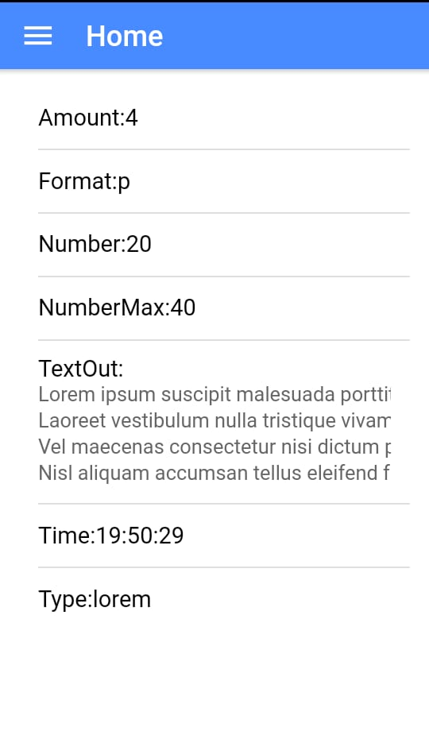
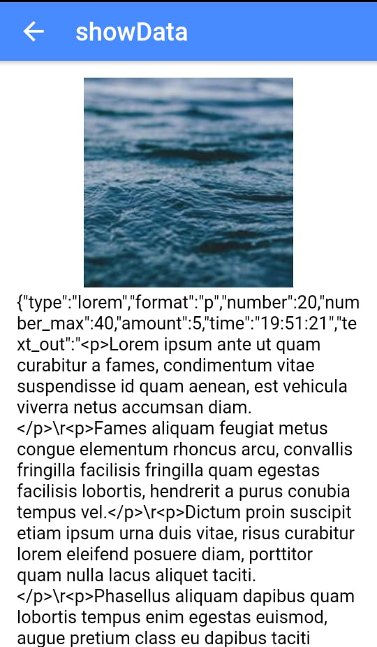
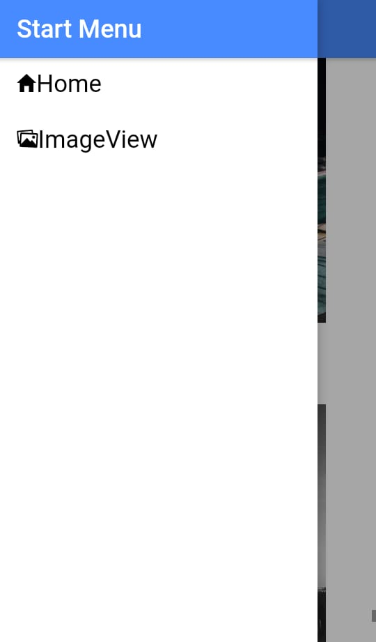

# Ionic Application
#### This an Ionic application, which display the list of data and image form API.
___

## API used on this Application
API Text data:- http://www.randomtext.me/api/
API for image:- https://picsum.photos

___

## App Work flow

1. Application display the list with a preview of text from API on home page.
2. Upon clicking any list item open showdata page to display all the values returned from the API and also random image on that model.
3. Sidemenu is implemented to redirect directly to other pages.
4. ImageView page display a random image on list from image API.
5. Implemented a pull to refresh / infinite scroll to load more random list item.
___

## ScreenShots

___

## Reference
https://ionicframework.com/docs/v1/

